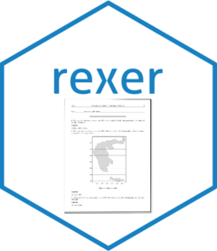
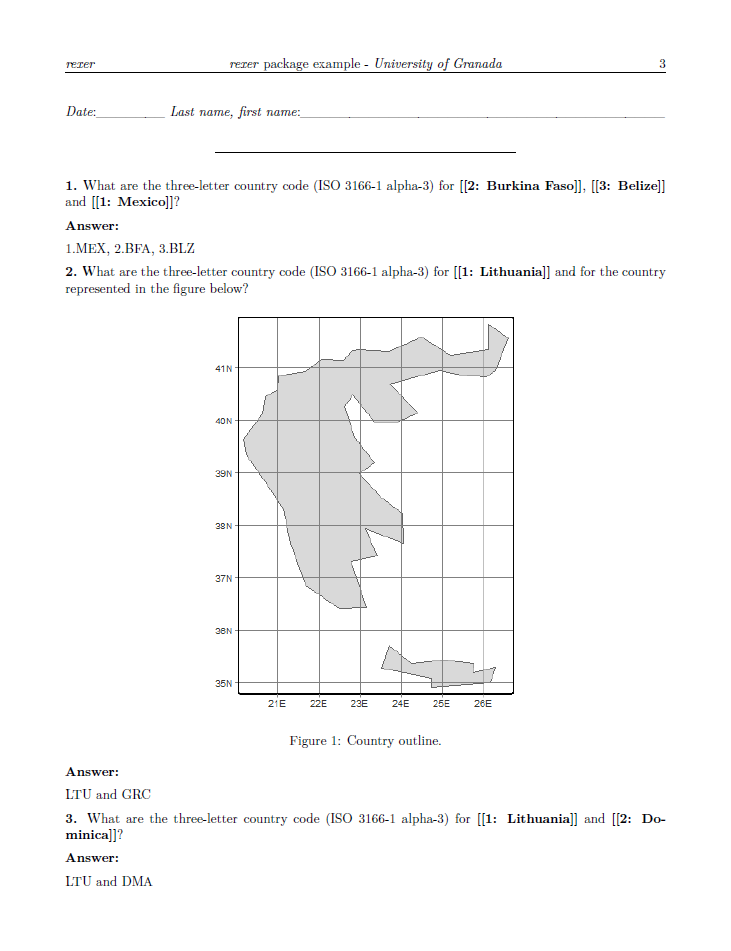

<!-- README.md is generated from README.Rmd. Please edit that file -->

```{r, include = FALSE}
knitr::opts_chunk$set(
  collapse = TRUE,
  comment = "#>",
  fig.path = "man/figures/README-",
  out.width = "100%"
)
```


# rexer 


<!-- badges: start -->
[](https://app.codecov.io/gh/josesamos/rexer?branch=main)
[](https://github.com/josesamos/rexer/actions/workflows/R-CMD-check.yaml)
<!-- badges: end -->

The goal of `rexer` is to facilitate the generation of exams incorporating random elements to exercises. It is a generalization of the *string exercises* found in the [`exams`](https://CRAN.R-project.org/package=exams) package, enabling the definition of exercises within a table and the inclusion of random components within specified gaps without the need to include R code.

Incorporating randomness within each exercise enhances exam security, ensuring that each student is compelled to focus on their own test rather than attempting to obtain answers from their peers.

Documents can be generated in PDF, HTML, or Word format. It produces a version for conducting the assessment and a version that facilitates the correction, linked through a code.


## Installation

You can install the released version of `rexer` from [CRAN](https://CRAN.R-project.org) with:

``` r
install.packages("rexer")
```

And the development version from [GitHub](https://github.com/) with:

<!-- You can install the development version from [GitHub](https://github.com/) with: -->

``` r
devtools::install_github("josesamos/rexer")
```

## Example

This is a basic example that shows how to generate 10 exam instances for the students to take and another 10 for correction, using exercises included in a CSV file:

```{r example, eval=FALSE}
library(rexer)

rmd <- system.file("extdata/template01.Rmd", package = "rexer")
exercises <- system.file("extdata/exercises.csv", package = "rexer")
ex <- exam(
  rmd = rmd,
  examinees = NULL,
  instances_num = 10,
  random = TRUE,
  reorder_exercises = TRUE
) |>
  define_exercises_from_csv(exercises) |>
  generate_document(out_dir = tempdir(), new_pages = 'all') |>
  generate_correction_document(out_dir = tempdir(), new_pages = 'none')
```

Each exam is generated from an *Rmd* format template, which includes selected exercises with defined random components. The content of the exercise file is displayed below.

````{verbatim, lang = "csv"}
"type","statement","image","image_alt","answer","a_1","a_2","a_3"
"","What is the three-letter country code (ISO 3166-1 alpha-3) for [[1]]?","","","LTU<|>URY<|>MEX<|>GAB","Lithuania<|>Uruguay<|>Mexico<|>Gabon","",""
"","What are the three-letter country code (ISO 3166-1 alpha-3) for [[1]] and [[2]]?","","","LTU and DMA<|>URY and MLI<|>MEX and BFA<|>GAB and BDI","Lithuania<|>Uruguay<|>Mexico<|>Gabon","Dominica<|>Mali<|>Burkina Faso<|>Burundi",""
"","What are the three-letter country code (ISO 3166-1 alpha-3) for {{[[1]], [[2]] and [[3]]}}?","","","1.LTU, 2.DMA, 3.VCT<|>1.URY, 2.MLI, 3.PRY<|>1.MEX, 2.BFA, 3.BLZ<|>1.GAB, 2.BDI, 3.KGZ","Lithuania<|>Uruguay<|>Mexico<|>Gabon","Dominica<|>Mali<|>Burkina Faso<|>Burundi","St. Vincent & Grenadines<|>Paraguay<|>Belize<|>Kyrgyzstan"
"p","What are the three-letter country code (ISO 3166-1 alpha-3) for [[1]] and for the country represented in the figure below?","xxxxx/[[2]]","Country outline.","LTU and GRC<|>URY and GBR<|>MEX and JPN<|>GAB and BRA","Lithuania<|>Uruguay<|>Mexico<|>Gabon","greece.png<|>united_kingdom.png<|>japan.png<|>brazil.png",
````

The gaps in the exercises are numbered (e.g., "[[1]]") and are filled with the associated elements defined in vector form. It is also possible to define elements that appear in random order (e.g., "{{[[1]], [[2]], and [[3]]}}"), so that in the instantiated version, the gaps can appear in any order. In each exercise, there can be as many gaps as desired, with the number of options we want in each gap.

Figures can be included in the exercises by simply indicating the file name and the caption text. Figures included in each exercise can also be selected like any other element for which a gap and a vector of options have been defined.

Among the exam generation options, we can choose to generate them randomly or based on the generated instance number, so that exams repeat in a cycle according to the number of elements defined to fill the gaps.

In any case, for correction, we will have the assistance of the version where the filled gaps are highlighted, along with instructions for the answer defined for each available option.

Next, an example of a generated exam with correction support is provided.


