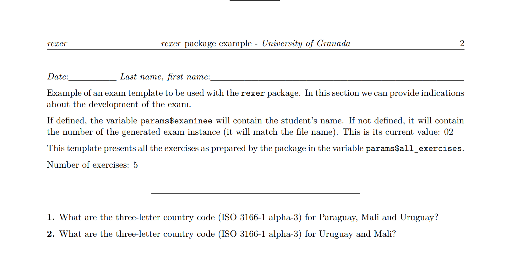
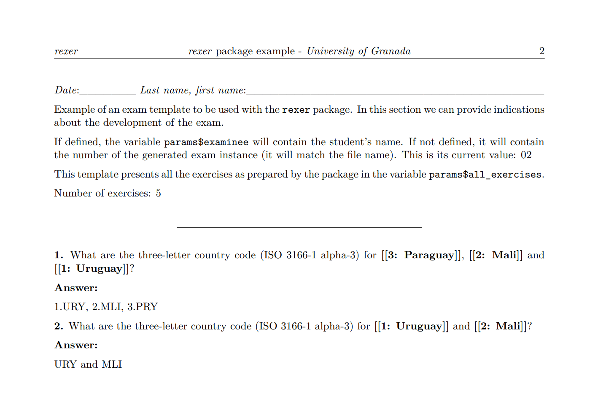

```{r, include = FALSE}
knitr::opts_chunk$set(
  collapse = TRUE,
  comment = "#>"
)
```


# Introduction

The goal of `rexer` is to facilitate the generation of exams incorporating random elements to exercises. This applies to both the exercises featured in the exam and the components defined within each exercise, all of which can be randomized. It can be considered as a generalization of the *string exercises* found in the [`exams`](https://CRAN.R-project.org/package=exams) package. 

Incorporating randomness within each exercise enhances exam security, ensuring that each student is compelled to focus on their own test rather than attempting to obtain answers from their peers.

Each exercise is a row in a table. It consists of a statement that may have gaps, as many as deemed necessary, and vectors of strings to fill each of those gaps by selecting one from them. It may also include a figure whose name or description can also have gaps. Additionally, we can indicate the answer either in the form of instructions or through a vector of strings associated with the vectors of the gaps. 

Documents can be generated in PDF, HTML, or Word format. It produces a version for conducting the assessment and a version that facilitates the correction, linked through a code.

The rest of this document is structured as follows: First, the general process of defining exercises and exams is presented. Next, we show the generation of exam instances, both to provide to the examinees and to support the correction. Finally, the document concludes with conclusions.

# Exercises and exams definition process

To define an exam, an *Rmd* file containing the exam template is required. Using this template, we instantiate an `exam` object. Communication between the object and the template occurs through parameters that must be included in the template. The values for these parameters are set within the object using associated definition methods.

## Object creation

The process of creating an `exam` object using one of the templates provided in the package is demonstrated below.

```{r setup}
library(rexer)

rmd <- system.file("extdata/template01.Rmd", package = "rexer")

ex <- exam(
  rmd = rmd,
  instances_num = 30,
  random = FALSE,
  reorder_exercises = TRUE,
  select_n_exercises = 5
)
```

From the template, we generate multiple instances of the exam. We can specify the instances to generate in two ways: by indicating a vector of examinee names (using the `examinees` parameter) or by specifying the number of instances to generate (using the `instances_num` parameter). If both are indicated, the examinee names take precedence. In the example, it is stated that we want to generate 30 instances of the exam.

We can generate the instances either randomly or sequentially, depending on the instance number we generate. This is controlled by the `random` parameter. The example indicates that generation is to be performed based on the generated instance number.

Additionally, in each test, we can include the exercises in the same order as they are defined or in random order. This is indicated by the `reorder_exercises` parameter.

Finally, using the `select_n_exercises` parameter, we can specify the number of exercises to include in each test. From all available exercises, the quantity specified in this parameter will be randomly selected. By default, all defined exercises are included.

In this example, from the exercises provided for the exam, 5 will be selected and randomly rearranged.

## Exercise definition

We can define the exercises one by one through the function `define_an_exercise()`, or alternatively, in a bulk manner using the functions `define_exercises()` (from a data frame), `define_exercises_from_csv()`, and `define_exercises_from_excel()`. These definition functions can be conveniently combined.

In the following example, we define an exercise whose random component is the presented image. Since the image is included in this package, we need to retrieve its folder using the `system.file()` function. If we have the images in a local folder, it is sufficient to specify its name.

```{r}
ex <- ex |>
  define_an_exercise(
    type = 'p',
    statement = 'What is the three-letter country code (ISO 3166-1 alpha-3) for
    the country represented in the figure below?',
    image = paste0(system.file('extdata/figures', package = 'rexer'), '/', '[[1]]'),
    image_alt = 'Country outline.',
    answer = c('ESP', 'CHL', 'NZL', 'ITA'),
    a_1 = c('spain.png', 'chile.png', 'new_zealand.png', 'italy.png')
  )
```

The random component of the example is defined by the gap identified by "[[1]]." We can define as many random components as necessary in the `statement`, `image`, and `image_alt` fields by simply incrementing the number in the gap mark. 

For each random component, we must specify the options to consider using additional parameters, which do not necessarily need names but can be indicated to prevent errors. In this case, in parameter `a_1`, we specify a vector of file names for images available in the package. 

Through the 'answer' parameter, we can include information to obtain the correct response, or, as in this case, a vector whose options correspond one-to-one with the options of the defined random component, so that the indicated response will be associated with the selected option of the random component.

Finally, by using the first parameter, `type`, and assigning it the value "p", we indicate whether we consider that the exercise should start on a new page. At the time of exam generation, we will be able to change this option.

We are now incorporating additional exercises into the exam, based on the definition provided in a CSV file.

```{r}
example <- system.file("extdata/example.csv", package = "rexer")

ex <- ex |>
  define_exercises_from_csv(example)
```

The content of the CSV file is displayed below. 

````{verbatim, lang = "csv"}
"type","statement","image","image_alt","answer","a_1","a_2","a_3"
"","What is the three-letter country code (ISO 3166-1 alpha-3) for [[1]]?","","","LTU<|>URY<|>MEX<|>GAB","Lithuania<|>Uruguay<|>Mexico<|>Gabon","",""
"","What is the three-letter country code (ISO 3166-1 alpha-3) for [[1]]?","","","?","Lithuania<|>Uruguay<|>Mexico<|>Gabon","",""
"","What are the three-letter country code (ISO 3166-1 alpha-3) for [[1]] and [[2]]?","","","LTU and DMA<|>URY and MLI<|>MEX and BFA<|>GAB and BDI","Lithuania<|>Uruguay<|>Mexico<|>Gabon","Dominica<|>Mali<|>Burkina Faso<|>Burundi",""
"","What are the three-letter country code (ISO 3166-1 alpha-3) for {{[[1]], [[2]] and [[3]]}}?","","","1.LTU, 2.DMA, 3.VCT<|>1.URY, 2.MLI, 3.PRY<|>1.MEX, 2.BFA, 3.BLZ<|>1.GAB, 2.BDI, 3.KGZ","Lithuania<|>Uruguay<|>Mexico<|>Gabon","Dominica<|>Mali<|>Burkina Faso<|>Burundi","St. Vincent & Grenadines<|>Paraguay<|>Belize<|>Kyrgyzstan"
"","What are the three-letter country code (ISO 3166-1 alpha-3) for {{[[1]], [[2]] and [[3]]}}?","","","?","Lithuania<|>Uruguay<|>Mexico<|>Gabon","Dominica<|>Mali<|>Burkina Faso<|>Burundi","St. Vincent & Grenadines<|>Paraguay<|>Belize<|>Kyrgyzstan"
"","What are the three-letter country code (ISO 3166-1 alpha-3) for {{[[1]], [[2]] and [[3]]}}?","","","?","Lithuania<|>Uruguay<|>Mexico<|>Gabon","Dominica<|>Mali<|>Burkina Faso","St. Vincent & Grenadines<|>Paraguay"
````

The table containing these exercises is shown below.

```{r, results = "asis"}
df <- read_exercise_csv(example)
pander::pandoc.table(df, split.table = Inf)
```

Each exercise is represented by a row in the table. To depict the options for filling in the gaps, we employ a vector of options, which, to be stored in a single field, is represented as a string using a separator for the vector elements: "<|>".

If we define the exercises through a spreadsheet, we will need to manually insert this separator between the different options. If a data frame is used, we can utilize function `vector_to_string()` as a support, which, given a vector, transforms it into a string by inserting these separators between its components.

As mentioned earlier, the random components of the examples are defined by the gaps identified by "[[n]]" where n increases within each exercise. If we have multiple gaps in the same exercise, we can specify that they be randomly reordered by including them in the markers "{{}}," as seen in various examples in the table. If we use this element, the answer will remain the same, but the order of appearance of the corresponding options may change. The sole purpose of this element is to make it challenging for the examinee to identify identical exercises between their exam and that of another person.

The package provides functions for creating a data frame (`create_exercise_data_frame()`), as well as empty CSV and Excel files (`create_exercise_csv()` and `create_exercise_excel()`) to which exercises can be added either programmatically or by directly editing them. It also includes other functions to read these structures into a data frame and to be able to modify them later if deemed necessary (`read_exercise_csv()` and `read_exercise_excel()`), and also to save the exercises in CSV format (`write_exercise_csv()`).

### Definition of answers in exercises

If we look at the first, second, fourth and fifth exercises in the table, we can see that they contain  gaps, and the options to consider for each of them have been defined. Regarding the answers, they are formed by the corresponding options for each of the gaps in order: the first option for each of the gaps, the second for each of the gaps, and so on. In other words, if the answer is a vector, there is a correspondence between it and the other vectors to fill the gaps, and only these vectors will be used in the order indicated in the answer (first element of all gaps, second element of all gaps, etc.). However, if the answer is a single element (it can be empty), any combination of the available options to fill the gaps can be considered randomly.

To make it easier to define the answers, we can use the `set_pending_answers()` function. If we have indicated the '?' character in the answer column in the data frame, it generates the answer considering the options of the gaps in the order described in the paragraph above. Thus, we have to adapt the answer for each combination of the specified options.

```{r}
df <- set_pending_answers(df)
```

The table below shows the result obtained from the previous table after applying this function.

```{r, results = "asis"}
pander::pandoc.table(df, split.table = Inf)
```

In the last row of the table, we can observe that, since the gaps have a different number of options, it considers the one with the highest number of options and rotates through the others to generate the answer by combining them.

We can store the result in a CSV file (`write_exercise_csv()`) to facilitate the elaboration of the answers, given the options for each one.

## Template definition

An *Rmd* file containing the exam template is required to instantiate an `exam` object. Communication between the object and the template occurs through parameters that must be included in the template. The values for these parameters are set within the object using associated definition methods.

Below are the parameters and their default values specified in the templates included in the package.

````{verbatim, lang = "Rmd"}
  params:
  exam_number: 1
  exam_number_str: "01"
  examinee: "01"
  exercises: ""
  all_exercises: ""
---
````

The parameters `exam_number` and `exam_number_str` take the value of the generated exam instance number. Parameter `examinee` contains the examinee's name, if specified, or the same value as parameter `exam_number_str` if the vector of examinees has not been indicated. It is necessary to include the value of some of these parameters in the exam to establish a connection between the exam given to the examinee and the version where answers or instructions for correction are included.

Parameter `exercises` contains a vector with the statements of the generated exercises, allowing us to iterate through it and present each exercise according to our convenience, as shown in the example below.

```{verbatim, lang = "R"}
``{r, echo=FALSE, results='asis'}
for (i in seq_along(params$exercises)) {
  q <- paste0('**1.** ', params$exercises[i])
  cat(q)
}
``
```

Finally, parameter `all_exercises` contains all the statements of the exercises to be presented together; it is an alternative to presenting the exercises using parameter `exercises`. Its usage is demonstrated in the following example.

```{verbatim, lang = "R"}
`r params$all_exercises`
```

In the templates `template01.Rmd` and `template01.Rmd` included in the package, we can see examples of parameter usage.

# Generation of the exam instances

Once we have defined and configured the exam and the exercises it may contain, we can generate instances to distribute to the students and correction support instances using the `generate_document()` and `generate_correction_document()` functions.

```{r, eval=FALSE}
ex <- ex |>
  generate_document(out_dir = tempdir(), new_pages = 'all') |>
  generate_correction_document(out_dir = tempdir(), new_pages = 'none')

```

In both functions, we can specify the folder where we will generate the instances (parameter `out_dir`) and if we want to change the page layout indicated in each exercise (parameter `new_pages`): we can specify that each exercise is placed on a new page (value 'all') or that the page changes only when it is complete (value 'none'). Using the `output_format` parameter, we can specify the output document format (default is PDF).

In this case, they are generated in the same temporary folder, but we must indicate different folders because the corresponding files have the same name.

The result of the second generated exam in both versions is included in the package, in the files `02.pdf` and `02c.pdf`.

Below is the beginning of both documents. In the document to facilitate correction, we can see the gaps marked and numbered. In the first exercise, the order of the gaps has been changed, as indicated in the exercise definition, but the answers can be identified by the gap number used in them.

```{r, echo = FALSE, fig.align = 'center', out.width = "100%"}


```

In these examples, we can see that the instance number has been included in the upper-right corner. This number allows us to relate them for correction purposes.

# Conclusions

Through the `rexer` package, we can generate exams with exercises based on text and images, incorporating random elements. The exercises are defined in a table that can be edited in a spreadsheet or generated using R. Multiple options can be defined for each gap in the exercise statement, and we also have the flexibility to randomly reorder the gaps if desired. Exercises included in an exam can also be selected randomly. All these functionalities aim to generate exams with similar difficulty but different, reducing the likelihood of cheating among examinees.

Additionally, we can generate a correction-friendly version that may include answers if specified. In this case, we limit randomness based on the number of answers included in the exercise definition.
